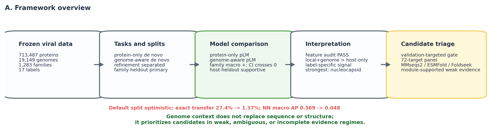

# ViruFunc V2

Leakage-aware genome-context modeling for out-of-distribution viral protein function annotation.

<p align="center">
  
</p>

This repository contains the public code, manifests, reproduction notes, and supplementary/source tables for the ViruFunc V2 study. The manuscript text and article figures are intentionally not included in this public code repository, except for the overview schematic shown above as the repository cover.

The central claim is conservative: genome context complements sequence and structure by prioritizing and sometimes helping disambiguate candidate viral protein functions under leakage-aware OOD evaluation.

## What Is Included

- `scripts/`: analysis, QC, homology, candidate-prioritization, sequence-structure-context triangulation, and manuscript-asset scripts.
- `configs/`: public dataset/source configuration.
- `data_manifest/`: frozen manifests, feature/label manifests, checksums, and compressed split files.
- `supplementary_tables/`: manuscript supplementary/source tables, including S22/S23/S24 sequence-structure-context outputs and S25 independent-evidence enrichment outputs.
- `reproduce/`: stepwise reproduction notes.
- `docs/`: additional implementation notes.

## What Is Not Included

Large or regenerable artifacts are intentionally excluded from the Git repository:

- raw RefSeq/NCBI/UniProt downloads;
- processed protein indexes and full feature matrices;
- frozen pLM embeddings;
- trained model checkpoints;
- ESMFold predicted PDB archives;
- Foldseek databases, including PDB100;
- local `runs/` directories.
- manuscript LaTeX source, compiled PDFs, and article figures beyond the README cover schematic.

The 72-target sequence-structure-context panel is included as parsed evidence tables: target metadata, pLDDT summaries, Foldseek hits, ambiguity metrics, case rankings, and Figure 6 source data. Predicted PDB files can be regenerated from the target FASTA and scripts.

## Key Reproduction Entrypoints

Run from the repository root after preparing the data paths described in `configs/datasets.json` and `data_manifest/`.

```bash
python scripts/run_v2_paper_suite.py --help
python scripts/run_v2_review_completion.py --help
python scripts/run_v2_breakthrough_validation.py --help
python scripts/analyze_v2_independent_evidence_enrichment.py --help
python scripts/build_v2_figure1_overview_framework.py --help
python scripts/build_v2_figure6_sequence_structure_context.py --help
```

For the sequence-structure-context extension:

```bash
bash scripts/run_v2_breakthrough_validation.sh \
  --output-root runs/v2_sequence_structure_validation_server \
  --mmseqs-bin /path/to/mmseqs \
  --foldseek-bin /path/to/foldseek \
  --esmfold-python /path/to/esmfold/python \
  --foldseek-db /path/to/foldseek/pdb100/pdb \
  --run-esmfold \
  --run-foldseek
```

## Supplementary Tables Added For Figure 6

- `S22_*`: validation targets, controls, target homology, integrated evidence, guardrails, and sequence-structure-context report.
- `S23_*`: Figure 6 case rankings, validation matrix source, Foldseek ambiguity metrics, and top Foldseek hits.
- `S24_*`: sequence-context landscape extension.
- `S25_*`: post hoc independent-evidence enrichment comparing high-context-gain candidates with matched controls.

## License

Code in this repository is released under the MIT License. Source tables are provided for reproducibility of the ViruFunc V2 study; please cite the associated manuscript/software record when reusing them.
